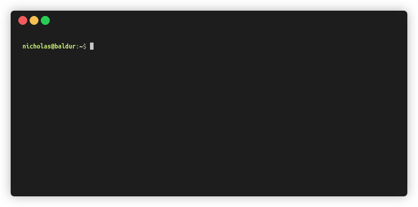
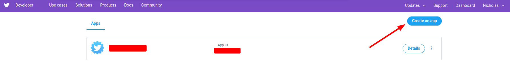
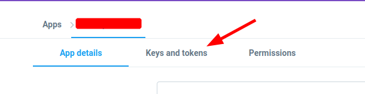
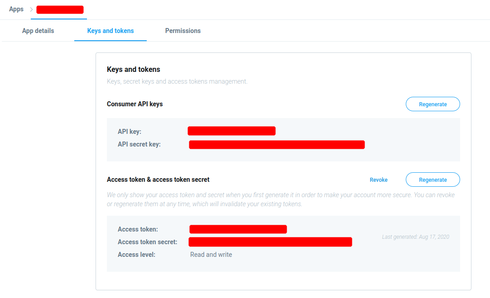

<br />
<p align="center">
  <a href="https://github.com/nnadeau/plumes">
    
  </a>

  <h3 align="center">plumes</h3>

  <p align="center">
    Simple Twitter CLI for day-to-day social media hygiene
    <br />
    ·
    <a href="https://github.com/nnadeau/plumes/issues">Report Bug</a>
    ·
    <a href="https://github.com/nnadeau/plumes/issues">Request Feature</a>
  </p>
</p>

## Contents

- [Contents](#contents)
- [Overview](#overview)
- [Inspiration](#inspiration)
- [Installation](#installation)
- [Usage](#usage)
  - [Getting Started And Creating Your Authentication Config](#getting-started-and-creating-your-authentication-config)
  - [Export Your Friends](#export-your-friends)
  - [Export Your Followers](#export-your-followers)
  - [Export Your Tweets](#export-your-tweets)
  - [Prune Your Friends](#prune-your-friends)
  - [Prune Your Tweets](#prune-your-tweets)
- [Setting Up Authentication](#setting-up-authentication)
  - [Get Your Twitter API Tokens](#get-your-twitter-api-tokens)
  - [Configuring `plumes`](#configuring-plumes)
- [Contributing](#contributing)
- [Testing](#testing)

## Overview

`Plumes` is an open-source Python CLI app for day-to-day social media hygiene.
It was designed to provide a simple, clear, and concise interface to quickly explore and clean a personal Twitter account.

## Inspiration

[](https://twitter.com/panzer/status/943935357673861120)

[](https://twitter.com/chrisalbon/status/1295408107078615041)

## Installation

```bash
# python >=3.6.1 is required
pip install plumes
```

## Usage

### Getting Started And Creating Your Authentication Config

```bash
# create your config file
plumes init
```

### Export Your Friends

```bash
plumes friends <flags>
```

- Optional flags:
  - `--screen_name`: alternative user (defaults to yourself)
  - `--limit`: max number of users to export
  - `--output`: alternative output path



### Export Your Followers

```bash
plumes followers <flags>
```

- Optional flags:
  - `--screen_name`: alternative user (defaults to yourself)
  - `--limit`: max number of users to export
  - `--output`: alternative output path

### Export Your Tweets

```bash
plumes tweets <flags>
```

- Optional flags:
  - `--screen_name`: alternative user (defaults to yourself)
  - `--limit`: max number of tweets to export
  - `--output`: alternative output path


### Prune Your Friends

```bash
plumes prune_friends PATH <flags>

# e.g.,
plumes friends --output "friends.json"
plumes prune_friends "friends.json" --min_followers 100 --execute
```

- `PATH`: path to JSON file exported from `plumes friends`
- Optional flags:
  - `--execute`: actually perform the pruning process, else a dry-run is performed
  - `--days`: prune by number of days since last tweeted
  - `--min_followers` / `--max_followers`: prune by number of followers
  - `--min_friends` / `--max_friends`: prune by number of friends
  - `--min_tweets` / `--max_tweets`: prune by number of tweets
  - `--min_ratio` / `--max_ratio`: prune by Twitter follower-friend (TFF) ratio


### Prune Your Tweets

```bash
plumes prune_tweets PATH <flags>

# e.g.,
plumes tweets --output "tweets.json"
plumes prune_tweets "tweets.json" --days 60 --execute
```

- `PATH`: path to JSON file exported from `plumes tweets`
- Optional flags:
  - `--execute`: actually perform the pruning process, else a dry-run is performed
  - `--days`: prune age of tweet
  - `--min_likes` / `--max_likes`: prune by number of likes
  - `--min_retweets` / `--max_retweets`: prune by number of retweets
  - `--min_ratio` / `--max_ratio`: prune by Twitter like-retweet ratio

## Setting Up Authentication

### Get Your Twitter API Tokens

- Navigate to the [Twitter Dev Portal](https://developer.twitter.com/en/apps)
- Click `Create an app`

  

- Fill out the forms
- Navigate to `Keys and tokens`

  

- Copy the values for `API key`, `API secret key`, `Access token`, and `Access token secret`

  

### Configuring `plumes`

The API tokens can either be set as environment variables (using the `PLUMES_` prefix; e.g., `export PLUMES_CONSUMER_KEY=xxxxx`) or configuration variables in `~/.plumes.toml`:

- CONSUMER_KEY = `<API key>`
- CONSUMER_SECRET = `<API secret key>`
- ACCESS_TOKEN = `<Access token>`
- ACCESS_TOKEN_SECRET = `<Access token secret>`

## Contributing

Please see [`CONTRIBUTING.md`](.github/CONTRIBUTING.md) and the [Code of Conduct](CODE_OF_CONDUCT.md) for how to contribute to the project

## Testing

- Please review the [`Makefile`](Makefile) for an overview of all available tests
- The most important tests and `make` commands are highlighted below:

```bash
# auto-format code
make format

# perform all static tests
make check
```

---

<div>Icons made by <a href="https://smashicons.com/" title="Smashicons">Smashicons</a> from <a href="https://www.flaticon.com/" title="Flaticon">www.flaticon.com</a></div>
